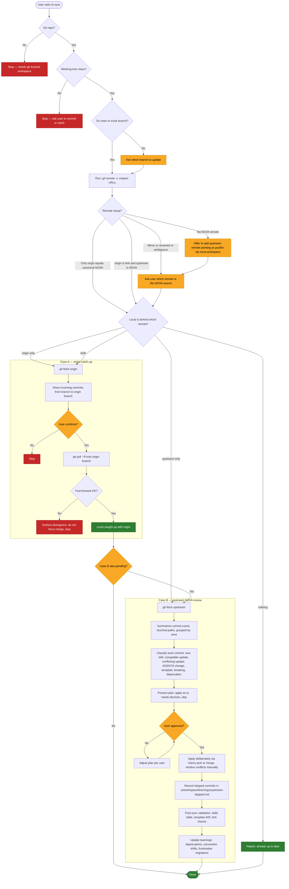

# Self-Update Workflow

End-to-end flow for the `self-update` skill. Read alongside `../SKILL.md`.

## How to read it

- **Preflight** (top) — bail early if the basics are not met.
- **Classify remotes** — fork-in-the-road moment. Decide whether this is Case A (your own remote) or Case B (upstream NOVA).
- **Case A** (left) — simple fetch, show, fast-forward pull. Refuses to force a merge if local has diverged.
- **Case B** (right) — deliberate flow: fetch → classify → plan → confirm → apply → validate → learn. Skipped commits are recorded so they do not re-propose on the next sync.
- **Red** nodes mean stop or error, **yellow** means user input needed, **green** means success.
